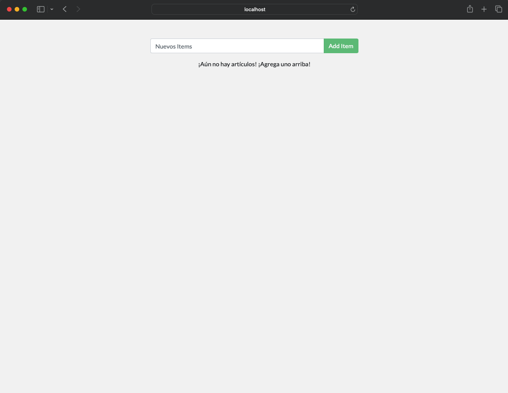

### Requisitos Previos

- Node.js (versión 18 o superior) instalado en tu sistema.
- MySQL instalado y configurado localmente, contenedor o acceso a una instancia remota.

### Pasos a Seguir

1. **Clonar el Repositorio:** Clona el repositorio que contiene el código fuente de la aplicación Todo-List desde el sistema de control de versiones donde esté alojado (por ejemplo, GitHub).

   ```bash
   git clone <url_del_repositorio>
   ```

2. **Instalar Dependencias:** Navega al directorio del proyecto y ejecuta el siguiente comando para instalar las dependencias de Node.js.

   ```bash
   cd <directorio_del_proyecto>
   npm install
   ```

3. **Configurar la Base de Datos:** Asegúrate de tener una base de datos MySQL disponible. Puedes crear una base de datos y una tabla para almacenar las tareas. A continuación, asegúrate de configurar las credenciales de conexión a la base de datos en el archivo de configuración del proyecto.

4. **Ejecutar la Aplicación:** Una vez que las dependencias estén instaladas y la base de datos esté configurada, puedes ejecutar la aplicación con el siguiente comando:

   ```bash
   npm start
   ```

   Este comando iniciará el servidor Express y la aplicación estará disponible en la dirección localhost en el puerto especificado en la configuración (generalmente el puerto 3000 por defecto).

5. **Probar la Aplicación:** Abre tu navegador web y navega a la dirección `http://localhost:3000` (o al puerto que hayas especificado). Deberías poder acceder a la interfaz de usuario de la aplicación Todo-List y realizar operaciones como crear, leer, actualizar y eliminar tareas.

6. **Desde el Navegador:**




### Notas Adicionales

- Asegúrate de que tu base de datos MySQL esté en funcionamiento y que la configuración de conexión en la aplicación sea correcta.
- Si encuentras algún problema, revisa los mensajes de error en la consola y verifica la configuración de la aplicación y de la base de datos.
- Puedes utilizar herramientas como MySQL Workbench o phpMyAdmin para administrar tu base de datos y verificar si las operaciones CRUD están funcionando correctamente.